# Harness Runner

Harness Runner 用来把 `prd.json` 里的用户故事转成面向 Cline 的上下文增强执行Ralph循环。每次执行都会注入项目约束、设计上下文、既往任务记忆、源码上下文、执行检查点，以及更严格的完成契约。
如果你希望智能体在持续执行实现类故事时，仍然遵守仓库规则、UI 设计意图和已有决策，Harness Runner就是为这个场景准备的。

## 运行流程图

```mermaid
flowchart TD
    Start([开始]) --> GeneratePRD["📝 生成/追加 PRD<br/>创建 prd.json 用户故事清单"]

    subgraph S1["📂 约束与上下文准备"]
        GeneratePRD --> ConstraintsSetup["⚙️ 初始化项目约束<br/>扫描工作区生成约束工件"]
        ConstraintsSetup --> DesignSetup["🎨 界面设计描述<br/>项目级/页面级/模块级<br/>故事级设计上下文"]
        DesignSetup --> SourceContext["📂 刷新源码上下文索引<br/>生成 source-context-index.json"]
        SourceContext --> AgentMap["🗺️ 生成 Agent Map<br/>知识目录与执行 runbook"]
        AgentMap --> StoryContext["🔍 为故事添加上下文<br/>关联最相关源码线索"]
    end

    subgraph S2["✅ 运行前检查 Preflight"]
        StoryContext --> PreflightCheck{"检查项<br/>1. 项目约束是否已初始化<br/>2. 设计上下文是否覆盖<br/>3. 策略门禁预检"}
        PreflightCheck -->|不通过| BlockPreflight["⛔ 记录失败日志<br/>停止运行"]
    end

    BlockPreflight --> End1([结束])
    PreflightCheck -->|通过| LoopCheck{"🔄 判断是否有<br/>待执行故事"}
    LoopCheck -->|无| Complete["🎉 全部完成"]
    Complete --> End2([结束])
    LoopCheck -->|有| BuildPrompt["📦 构建提示词<br/>系统规则→约束→设计→记忆<br/>源码上下文→检查点→门禁<br/>故事→契约"]

    subgraph S3["🤖 Cline 执行阶段"]
        BuildPrompt --> DelegateCline["委托 Cline 执行<br/>发送 handoff 提示词"]
        DelegateCline --> WaitForSignal["等待完成信号<br/>轮询 completed 状态"]
        WaitForSignal --> TimeoutCheck{"超时?"}
    end

    TimeoutCheck -->|是| TimeoutFailed["❌ 故事失败<br/>记录故障日志"]
    TimeoutFailed --> End3([结束])
    TimeoutCheck -->|否| ArtifactCheck["🧪 验证核心工件<br/>任务记忆/检查点/证据包"]
    ArtifactCheck -->|缺失| SynthesizeFallback["合成 fallback 工件<br/>不阻塞流程"]
    SynthesizeFallback --> PolicyCompletion
    ArtifactCheck -->|完整| PolicyCompletion

    subgraph S4["🔒 完成门禁 Completion Gates"]
        PolicyCompletion{"门禁校验<br/>路径限制/命令验证<br/>知识检查/Agent Map"}
        PolicyCompletion -->|不通过| CanRetry{"能否修复?<br/>分析失败原因"}
        CanRetry -->|能| AutoFix["🔧 委托 Cline 修复<br/>重新执行门禁校验"]
        AutoFix --> PolicyCompletion
        CanRetry -->|不能| GateBlocked["⛔ 门禁失败<br/>标记 failed 状态"]
    end

    GateBlocked --> End4([结束])
    PolicyCompletion -->|通过| ReviewerCheck{"评审循环<br/>已启用?"}

    subgraph S5["🔍 Reviewer Agent 评审循环"]
        ReviewerCheck -->|是| ReviewerLoop["Reviewer Agent 评审<br/>多维度评分"]
        ReviewerLoop --> ReviewPass{"评分<br/>≥ 达标分数?"}
        ReviewPass -->|否| AutoRefactor{"未超出<br/>重构上限?"}
        AutoRefactor -->|是| RefactorCline["自动重构循环<br/>重新委托 Cline 修复"]
        RefactorCline --> PolicyCompletion
        AutoRefactor -->|否| MaxReached["达到重构上限<br/>记录评审结果"]
    end

    ReviewerCheck -->|否| MaxReached
    ReviewPass -->|是| EvidenceEval["📊 证据包评估<br/>确定风险等级"]
    MaxReached --> EvidenceEval

    subgraph S6["💾 状态持久化与审批"]
        EvidenceEval --> RiskLevel{"风险<br/>等级?"}
        RiskLevel -->|低风险| Completed["状态 completed<br/>直接通过"]
        RiskLevel -->|中风险| PendingReview["状态 pendingReview<br/>待人工评审"]
        RiskLevel -->|高风险| PendingRelease["状态 pendingRelease<br/>待发布审批"]

        Completed --> PersistStatus
        PendingReview --> PersistStatus
        PendingRelease --> PersistStatus

        PersistStatus["持久化状态<br/>更新 status/progress/日志"]
        PersistStatus --> ApprovalCheck{"高风险<br/>需要审批?"}
        ApprovalCheck -->|是| ApprovalFlow["人工审批流<br/>批准/拒绝/补充说明"]
        ApprovalCheck -->|否| NextStory
        ApprovalFlow -->|批准| NextStory
        ApprovalFlow -->|拒绝| ReReview["退回 pendingReview"]
        ReReview --> NextStory
    end

    NextStory["➡️ 进入下一个故事"] --> LoopCheck

    classDef plan fill:#BBDEFB,stroke:#1565C0,stroke-width:3px,color:#0D47A1
    classDef check fill:#FFE0B2,stroke:#E65100,stroke-width:3px,color:#BF360C
    classDef exec fill:#C8E6C9,stroke:#2E7D32,stroke-width:3px,color:#1B5E20
    classDef gate fill:#F8BBD0,stroke:#AD1457,stroke-width:3px,color:#880E4F
    classDef review fill:#E1BEE7,stroke:#6A1B9A,stroke-width:3px,color:#4A148C
    classDef approve fill:#FFF9C4,stroke:#F57F17,stroke-width:3px,color:#E65100
    classDef finished fill:#E0E0E0,stroke:#424242,stroke-width:3px,color:#212121
    classDef subgraphStyle fill:none,stroke:#78909C,stroke-width:2px,stroke-dasharray: 5 5

    class GeneratePRD,ConstraintsSetup,DesignSetup,SourceContext,AgentMap,StoryContext plan
    class PreflightCheck,BlockPreflight check
    class BuildPrompt,DelegateCline,WaitForSignal,NextStory exec
    class PolicyCompletion,GateBlocked gate
    class ReviewerLoop,ReviewPass,AutoRefactor,RefactorCline,MaxReached,CanRetry,AutoFix review
    class ApprovalFlow,Completed,PendingReview,PendingRelease,ReReview approve
    class Complete,End1,End2,End3,End4,TimeoutFailed finished
    class S1,S2,S3,S4,S5,S6 subgraphStyle
```



## 核心能力

- 按 `prd.json` 中的优先级顺序执行用户故事
- 把运行状态持久化到 `.harness-runner/`，支持中断后恢复
- 允许 Cline 在不改写既有故事的前提下追加新的用户故事
- 扫描工作区生成机器可读和人工可编辑的项目约束
- 在 `.prd/design-context/` 下维护分层设计上下文，支持共享稿与故事级覆盖
- 要求故事完成前必须存在结构化任务记忆、执行检查点和证据包
- 在执行与复审中显式评估模块边界、职责清晰度、复用机会与回滚线索，而不是退化成单语言复杂度检查
- 根据证据自动给故事打风险等级，并进入 `completed`、`pendingReview` 或 `pendingRelease`
- 对高风险故事提供 IDE 内人工审批流，支持批准、拒绝和补充说明
- 在执行前回忆相关任务记忆与源码上下文，减少长会话漂移
- 基于 Agent Map 自动检查知识目录是否过期、模块知识是否缺失、运行说明是否覆盖当前变更面
- 通过可选的机器策略门禁，在故事开始前和完成前执行硬性校验
- 以固定顺序拼装提示词，保证新增上下文不会打乱主任务

## 菜单结构

Harness Runner 的状态栏入口和快捷键 Alt+R 会打开分层命令菜单。当前一级菜单包含两个直达命令和四个分组：

- 生成 PRD
- 追加用户故事
- Harness Runner 指南
- Harness 约束设置
- 执行与审批
- 设置

其中“Harness 约束设置”是约束与上下文准备的统一二级入口，集中放置以下能力：

- 配置执行检查
- 初始化项目约束
- 界面设计描述
- 为故事添加上下文
- 刷新源码上下文索引
- 生成 Agent Map

“设置”现在也是独立的二级入口，用来集中放置运行配置相关操作：

- 打开设置
- 自定义菜单排序（拖拽保存）

`Harness Runner 指南`、`Harness 约束设置`、`执行与审批` 和 `设置` 这四个二级菜单都保留“返回上一级”导航；`生成 PRD` 与 `追加用户故事` 则可以在一级菜单直接执行。菜单排序界面使用拖拽卡片调整顺序，只有点击保存后才会写入工作区 `.vscode/settings.json`，取消或直接关闭不会落盘。

这样做的目标是把最常用的规划入口直接提升到一级菜单，减少一次额外点击，同时继续把约束准备、执行审批和设置相关能力收纳在职责明确的二级分组中，并保持原有命令 id 和命令路由不变。

## 运行要求

- VS Code 1.109.0 及以上
- 已安装并启用 Cline
- 工作区根目录存在 `prd.json`

## 核心文件

### `prd.json`

`prd.json` 仍然是执行入口和故事清单的事实来源。它定义项目元数据以及待执行的用户故事列表。

```json
{
  "project": "MyProject",
  "branchName": "harness/feature-branch",
  "description": "项目目标的简短描述",
  "userStories": [
    {
      "id": "US-001",
      "title": "初始化项目结构",
      "description": "创建初始目录结构和配置文件",
      "acceptanceCriteria": [
        "目录创建完成",
        "配置文件已就位"
      ],
      "priority": 1
    }
  ]
}
```

| 字段 | 是否必填 | 说明 |
| --- | --- | --- |
| `project` | 是 | 项目名称 |
| `branchName` | 是 | 建议使用的 Git 分支名 |
| `description` | 是 | 项目整体目标 |
| `userStories` | 是 | 可执行用户故事数组 |
| `userStories[].id` | 是 | 稳定故事标识，如 `US-001` |
| `userStories[].title` | 是 | 故事短标题 |
| `userStories[].description` | 是 | 交给 Cline 的任务描述 |
| `userStories[].acceptanceCriteria` | 是 | 扁平化验收标准列表 |
| `userStories[].priority` | 是 | 数字越小越先执行 |

### 运行期工件

Harness Runner 会在执行过程中创建并维护下列工件：

| 路径 | 作用 |
| --- | --- |
| `.harness-runner/story-status.json` | 共享的故事状态表，同时承载故事级持久状态与运行期完成信号键 |
| `.harness-runner/project-constraints.generated.json` | 扫描生成的项目约束摘要，包含脚本、目录、允许路径、交付检查等 |
| `.harness-runner/project-constraints.md` | 团队手工维护的项目约束文档，会覆盖生成结果 |
| `.harness-runner/source-context-index.json` | 轻量级源码上下文索引，记录目录、入口、类型、热点路径等 |
| `.harness-runner/agent-map/overview.json` | 面向智能体的仓库总览页，聚合项目概览、模块职责、规则入口、执行 runbook 与文档索引 |
| `.harness-runner/agent-map/knowledge-catalog.json` | 面向智能体的知识目录页，按主题列出关键文档、工件与显式知识缺口 |
| `.harness-runner/policy-baselines/US-xxx.policy-baseline.json` | 故事开始前的工作区变更基线，供 completion 门禁忽略历史遗留改动 |
| `.harness-runner/memory/US-xxx.json` | 单个故事的结构化任务记忆 |
| `.harness-runner/memory-index.json` | 所有任务记忆的紧凑索引，用于后续 recall |
| `.harness-runner/checkpoints/US-xxx.checkpoint.json` | 单个故事最近一次执行检查点，记录摘要、风险、恢复建议 |
| `.harness-runner/evidence/US-xxx.evidence.json` | 故事证据包，记录测试、风险、发布说明、回滚线索和审批状态 |
| `.harness-runner/run-logs/US-xxx-*.run-log.txt` | 单次故事执行的文本运行日志，只保留 output 中筛选后的关键信息与最终摘要 |
| `.prd/design-context/US-xxx.design.json` | 故事级设计上下文或自动整理结果 |
| `.prd/design-context/shared/project.design.json` | 项目级共享设计上下文 |
| `.prd/design-context/shared/screen-<id>.design.json` | 页面/屏幕级共享设计上下文 |
| `.prd/design-context/shared/module-<id>.design.json` | 模块级共享设计上下文 |
| `.harness-runner/design-context-suggestions/US-xxx.suggestion.json` | 故事设计建议的临时工件 |
| `progress.txt` | 故事执行日志，记录 done/failed/pending-review/pending-release |

`progress.txt` 继续承担面向人的高层进度跟踪；更细的运行级信号会增量写入 `.harness-runner/run-logs/`。当前 run log 不再写结构化 JSON，而是以纯文本方式记录 output 中筛选出的关键信息，主动跳过轮询噪音，只保留适合人工快速阅读的关键摘要。

从当前版本开始，任务记忆、执行检查点和证据包都可以携带 `architectureNotes`，用于沉淀跨语言通用的架构判断，例如模块边界是否清晰、职责是否混杂、有哪些共享逻辑值得抽取，以及高风险改动的回滚切口在哪里。

## 推荐工作流

### 1. 生成或追加 PRD

使用 `HARNESS: 生成 PRD` 在工作区根目录创建 `prd.json`。后续有新增范围时，使用 `HARNESS: 追加用户故事` 让 Cline 基于现有 `prd.json` 原地追加。

Harness Runner 会结合工作区是否为 Git 仓库以及 `harness-runner.autoCommitGit` 设置，决定实现类故事是否应在同一故事内自行提交，而不是拆出专门的 Git 提交故事。

### 2. 初始化项目约束

在需要仓库特定规则之前，先执行 `HARNESS: 初始化项目约束`。

扫描范围包括：

- `package.json` 中的脚本与依赖
- `tsconfig.json`
- ESLint 配置
- `README.md`
- 常见源码、测试、文档和脚本目录

命令会产出两个工件：

- `.harness-runner/project-constraints.generated.json`：给提示词注入用的标准化 JSON
- `.harness-runner/project-constraints.md`：团队维护的可编辑规则文档

生成结果故意保持通用，只总结脚本、目录、约束线索等基础信号。真正的团队规则应当手工写进 `.harness-runner/project-constraints.md`，不要完全依赖自动推断。

### 3. 刷新源码上下文索引

执行 `HARNESS: 刷新源码上下文索引`，生成 `.harness-runner/source-context-index.json`。

该索引复用项目约束扫描结果，再补充以下轻量信号：

- 源码目录
- 测试目录
- 构建与校验脚本
- 关键入口文件
- 可复用模块线索
- 类型定义线索
- Git 历史存在时的近期热点路径

在正常执行流程中，Harness Runner 会在进入下一个故事前自动刷新索引。如果仓库很大、没有 Git 历史、或部分文件缺失，索引生成会降级为更少的信号，但仍会写出合法工件，不会阻塞运行。

### 4. 为故事回忆最相关的源码上下文

Harness Runner 会从 `.harness-runner/source-context-index.json` 中，为当前故事召回最相关的源码上下文，并把结果注入 `Relevant Source Context` 提示词段落。

召回评分会综合：

- 故事标题、描述、验收标准中的关键词
- 显式的模块提示与文件提示
- 来自相关任务记忆的有界 recall 提示
- 入口文件、复用模块、类型定义、热点路径等不同类别的权重

使用 `HARNESS: 为故事添加上下文` 可以在执行前查看命中结果，并把相关模块、文件和工程线索补充到当前故事的上下文准备里。如果没有足够强的匹配，Harness Runner 会回退到原有提示构建流程并记录可读日志，而不是直接失败。

### 4.5 生成 Agent Map 与知识目录

执行 `HARNESS: 生成 Agent Map` 后，Harness Runner 会把轻量级导航工件写入 `.harness-runner/agent-map/`：

- `overview.json`：聚合项目概览、模块职责、规则入口、执行 runbook、文档索引
- `knowledge-catalog.json`：把关键文档与工件按主题编目，并为后续新鲜度检查保留 `exists`、`lastModified`、`freshnessTarget` 等字段

生成逻辑会尽量复用现有工件，例如项目约束、源码上下文索引、PRD、README 和设计上下文目录；如果仓库里缺少某类知识，Agent Map 会把缺口显式记录到 `gaps`，而不是静默省略。

从当前版本开始，Harness Runner 在执行故事和构建 Cline handoff 提示词时会自动读取 `overview.json` 与 `knowledge-catalog.json`，结合故事描述、当前变更面和 README / runbook 文本，生成三类检查结果：

- `stale-documentation`：知识目录或运行说明可能已经落后于相关实现
- `missing-module-knowledge`：当前模块在 Agent Map 中只有弱信号或根本没有记录
- `missing-runbook-coverage`：README / runbook 没有清楚覆盖本次变更涉及的操作路径

默认情况下，这些结果会作为 advisory 注入到故事提示词与 Cline handoff 提示词里；如果你在 `policyGates` 里启用 `knowledge-check` 规则，也可以把 warning 级问题升级为完成前 gate。

### 5. 为 UI 敏感故事维护分层设计上下文

使用 `HARNESS: 界面设计描述` 作为 UI 相关流程的统一入口。

推荐用法：

1. 先选择“批量匹配多个故事”或生成共享设计稿，把可复用规则存到 `.prd/design-context/shared/`
2. 对单个故事选择“单独匹配当前故事”，按需挂接项目级、页面级或模块级共享设计上下文
3. 如果故事存在特殊视觉差异，再补故事级设计稿或导入 Figma / 截图

设计工件可记录：

- Figma 链接
- 截图路径
- 参考文档
- 摘要和手工说明
- 布局约束
- 组件复用目标
- Token 规则
- 响应式要求
- 禁止修改区域
- 明确的视觉验收项

共享稿适合多个故事共用的壳层、布局或组件规则；故事级稿只保留差异项，避免提示词冗余。

### 6. 执行时懒加载设计合成

对设计敏感故事，如果没有显式的故事级设计工件，Harness Runner 会在执行时根据已有共享设计上下文和故事元数据，合成一个有界的 `Design Context` 段落。

优先顺序是：

- 已关联或推断出的共享项目/页面/模块设计稿
- 共享稿中已有的视觉输入
- 当前故事的标题、描述和验收标准

合成结果只保留执行关键字段，例如视觉输入、布局关注点、复用关注点、Token 关注点、保护区和验收重点，不会把原始说明全部倾倒进提示词。

### 7. 注入相关任务记忆与最近检查点

执行过程中，Harness Runner 会自动回忆相关任务记忆，并以有界形式注入 `Relevant Prior Work`。

评分因子包括：

- 关联故事或依赖关系
- 关键词重叠
- 模块提示
- 变更文件重叠
- 时间新近度

在此基础上，Harness Runner 还会从 `.harness-runner/checkpoints/` 中选择合适的检查点，注入 `Recent Checkpoint`。

选择策略固定且可预期：

- 重跑同一个故事时，优先选择该故事自己的最新有效检查点
- 否则回退到其他故事里最近更新的有效检查点
- 如果没有有效检查点，则省略该段并继续运行

这保证了会话切换后仍有一个短而稳定的“上一次执行摘要”。

### 8. 机器策略门禁

`harness-runner.policyGates` 用于启用机器可执行的策略门禁。它分为两个阶段：

- `preflightRules`：故事开始前执行
- `completionRules`：Cline 写出完成信号后、Harness Runner 接受故事完成前执行

首批规则类型包括：

- `required-artifact`：要求存在某类工件，如项目约束、设计上下文、任务记忆、检查点、证据包
- `restricted-paths`：阻止改动危险路径，如 `prd.json`、`.prd/**`、构建产物目录等
- `require-command`：要求至少一个相关测试或构建命令成功执行
- `knowledge-check`：要求 Agent Map / 知识目录保持足够新鲜，并对模块知识缺口、运行说明缺口进行阻断

一旦启用门禁，Harness Runner 还会在 `.harness-runner/policy-baselines/` 中记录故事开始前的工作区变更基线。completion 门禁只检查本次故事新增的改动，避免历史遗留脏工作区误伤当前故事。

与旧逻辑兼容的设置仍然保留：

- `harness-runner.requireProjectConstraintsBeforeRun`
- `harness-runner.requireDesignContextForTaggedStories`

如果 `harness-runner.policyGates.enabled` 仍为 `false`，则继续沿用旧行为，不会突然强制启用这些新门禁。

### 9. 结构化完成契约

Cline 在结束前必须写出：

- `.harness-runner/memory/US-xxx.json` 任务记忆
- `.harness-runner/checkpoints/US-xxx.checkpoint.json` 执行检查点
- `.harness-runner/evidence/US-xxx.evidence.json` 证据包

任务记忆至少应包含：

- `summary`
- `changedFiles`
- `changedModules`
- `keyDecisions`
- `constraintsConfirmed`
- `testsRun`
- `risks`
- `followUps`
- `searchKeywords`

如果 Cline 没有写出合法工件，Harness Runner 会合成一个可恢复的 fallback 工件，并继续推进，而不是因为上下文损坏直接卡死。

### 10. 证据包与人工审批流

`.harness-runner/evidence/US-xxx.evidence.json` 会记录：

- 变更文件与模块范围
- 测试执行证据
- 风险等级及原因
- 发布说明与回滚线索
- 后续事项与证据缺口
- 是否建议 feature flag
- 审批状态、审批时间、审批摘要和审批历史
- 最终可审计状态：`completed`、`pendingReview`、`pendingRelease`

如果关键证据缺失，例如没有通过的测试、无法确认变更范围、或触达了核心执行面，故事不会被静默视作普通完成，而是进入 `pendingReview` 或 `pendingRelease`。

对高风险故事，可以使用 `HARNESS: 审批故事` 在 VS Code 内完成以下操作：

- 批准当前评审阶段
- 批准发布阶段
- 拒绝并退回 `pendingReview`
- 只补充审批说明而不改变状态

这些操作会同时更新 evidence、`.harness-runner/story-status.json` 和 `progress.txt`，确保审计轨迹一致。

### 11. 提示词拼装顺序

执行 `HARNESS: 开始执行` 时，提示词固定按下列顺序构建：

1. 系统执行规则
2. 项目约束
3. 设计上下文
4. 相关既往工作
5. 相关源码上下文
6. 最近检查点
7. 机器策略门禁
8. 当前故事
9. 完成契约

每个可选段落都有长度上限，避免上下文无限膨胀。新增的 `Relevant Source Context` 固定处于 `Relevant Prior Work` 和 `Recent Checkpoint` 之间，新增的 `Machine Policy Gates` 固定处于 `Recent Checkpoint` 和 `Current Story` 之间。

## 分层菜单

执行 `HARNESS: 显示菜单` 后，一级菜单固定包含两个直达命令和四类分组：`生成 PRD`、`追加用户故事`、`Harness Runner 指南`、`Harness 约束设置`、`执行与审批`、`设置`。

- `生成 PRD`、`追加用户故事` 作为一级直达命令，直接触发规划相关操作
- `Harness Runner 指南` 统一承载插件介绍、推荐使用流程和后续 harness-engineering 资料扩展入口
- `Harness 约束设置` 统一承载执行检查、项目约束、界面设计描述、故事上下文、源码上下文索引和 Agent Map
- `执行与审批` 统一承载开始、重新执行失败故事、停止、状态、审批和重置
- `设置` 统一承载打开设置和一级菜单排序

除一级直达命令外，各级子菜单的第一项都是 `返回上一级`。后续如果继续增加三级或更深层菜单，也沿用同一套菜单节点定义和返回导航规则，而不是在命令逻辑里额外硬编码分支。

## 命令

| 命令 | 说明 |
| --- | --- |
| `HARNESS: 开始执行` | 开始或继续自动执行循环 |
| `HARNESS: 停止执行` | 立即取消当前循环 |
| `HARNESS: 查看状态` | 查看完成数、待处理数、下一个故事和运行状态 |
| `HARNESS: 审批故事` | 对待人工审批的高风险故事执行批准、拒绝或补充说明 |
| `HARNESS: 重置故事` | 重置某个已完成或已失败的故事，允许重新执行 |
| `HARNESS: 初始化项目约束` | 扫描工作区并生成项目约束工件 |
| `HARNESS: 刷新源码上下文索引` | 刷新轻量级源码上下文索引 |
| `HARNESS: 为故事添加上下文` | 为当前故事准备最相关的源码上下文线索 |
| `HARNESS: 界面设计描述` | 统一处理故事级与共享级设计上下文 |
| `HARNESS: 生成 PRD` | 生成新的 `prd.json` |
| `HARNESS: 追加用户故事` | 在现有 `prd.json` 上追加新故事 |
| `HARNESS: 打开设置` | 打开扩展设置 |
| `HARNESS: 自定义菜单排序` | 调整一级菜单中直达命令与分组入口的显示顺序 |
| `HARNESS: 显示菜单` | 打开状态栏命令菜单 |

## Cline Handoff

初始化项目约束后，Harness Runner 会把合并后的项目约束、Agent Map 提醒和故事上下文一起拼成最终执行提示词，并直接交给新的 Cline 任务。

该流程会读取 `.harness-runner/project-constraints.generated.json` 和 `.harness-runner/project-constraints.md` 的合并结果，其中人工维护的 Markdown 规则优先级更高。

如果工作区已经存在 Agent Map，handoff 提示词还会附带知识目录过期、模块知识缺失、运行说明覆盖不足等提醒，帮助最终提示词显式要求补齐缺口，而不是只给出一条笼统的“文档不足”提示。

## 设置项

| 设置项 | 默认值 | 类型 | 说明 |
| --- | --- | --- | --- |
| `harness-runner.maxAutonomousLoops` | `2` | number | 单次运行最多连续执行多少个故事 |
| `harness-runner.loopDelayMs` | `3000` | number | 每轮自动执行之间的等待时间 |
| `harness-runner.executionResponsePollMs` | `5000` | number | 轮询 Cline 是否写出完成信号的间隔 |
| `harness-runner.executionTimeoutMs` | `3600000` | number | 单个故事的最大等待时长 |
| `harness-runner.executionMinWaitMs` | `15000` | number | 开始检查完成信号前的最小等待时间 |
| `harness-runner.autoInjectProjectConstraints` | `true` | boolean | 自动把合并后的项目约束注入故事提示词 |
| `harness-runner.requireProjectConstraintsBeforeRun` | `false` | boolean | 开启后，未初始化项目约束时阻止执行 |
| `harness-runner.autoInjectDesignContext` | `true` | boolean | 自动注入已解析或合成的设计上下文 |
| `harness-runner.requireDesignContextForTaggedStories` | `false` | boolean | 开启后，设计敏感故事缺少设计覆盖时阻止执行 |
| `harness-runner.policyGates` | schema object | object | 机器策略门禁配置，统一描述 preflight/completion 规则 |
| `harness-runner.policyGateCommandTimeoutMs` | `600000` | number | 门禁执行测试/构建命令时的超时时间 |
| `harness-runner.autoRecallTaskMemory` | `true` | boolean | 自动回忆并注入相关任务记忆 |
| `harness-runner.autoCommitGit` | `true` | boolean | 在 Git 仓库中，要求故事在同一执行阶段内自行提交 |
| `harness-runner.recalledTaskMemoryLimit` | `3` | number | 最多注入或预览多少条任务记忆 |
| `harness-runner.language` | `Chinese` | string | 运行时 UI 语言，支持中文和英文 |
| `harness-runner.rootMenuOrder` | `['quickStart', 'appendUserStories', 'guides', 'constraints', 'execution', 'settings']` | string[] | 自定义一级菜单顺序；旧的 `planning` 值会自动映射为两个规划直达命令，缺失或重复值会自动回退到默认顺序；通过“自定义菜单排序”保存时会写入工作区的 `.vscode/settings.json` |

### 默认开启与默认关闭

默认开启：

- `autoInjectProjectConstraints`
- `autoInjectDesignContext`
- `autoRecallTaskMemory`
- `autoCommitGit`

默认关闭：

- `requireProjectConstraintsBeforeRun`
- `requireDesignContextForTaggedStories`
- `policyGates.enabled`

说明：`policyGates` schema 内虽然默认包含若干 completion 规则，但只要 `policyGates.enabled` 仍为 `false`，这些规则就不会实际生效。

## 测试覆盖与验证建议

当前测试重点覆盖以下路径：

- 提示词完成契约必须要求任务记忆、检查点和证据包
- 提示词段落顺序固定，源码上下文、知识检查、检查点、策略门禁的位置可验证
- 策略门禁能阻止危险路径改动，并能要求相关测试命令通过或拦截知识检查问题
- 证据包可合成、可读写、可校验，并能驱动 `pendingReview` / `pendingRelease`
- 人工审批流的批准、拒绝、补充说明会产生可审计状态流转和审批历史
- 旧版 evidence 工件即使没有审批字段，也能在升级后被兼容归一化

推荐在本地至少执行：

1. `npm run compile`
2. `npm run compile-tests`
3. `npm test`

## 迁移指南

### 从旧工作区升级到当前版本

旧工作区不需要一次性补齐所有新工件。Harness Runner 会按需逐步生成：

- 任务记忆：在故事完成时写入 `.harness-runner/memory/US-xxx.json`
- 执行检查点：在故事完成、失败或中断时写入 `.harness-runner/checkpoints/US-xxx.checkpoint.json`
- 源码上下文索引：首次手动刷新或每次自动执行前生成 `.harness-runner/source-context-index.json`
- 策略基线：只在启用 `policyGates.enabled` 后，故事开始时写入 `.harness-runner/policy-baselines/US-xxx.policy-baseline.json`
- 证据包：故事完成时写入 `.harness-runner/evidence/US-xxx.evidence.json`

### 哪些能力会默认生效

升级后会自然生效但兼容旧工作区的能力：

- 检查点注入与新会话执行
- 源码上下文索引与 recall
- 任务记忆与证据包的自动读写
- 高风险故事的待评审 / 待发布状态

升级后不会默认强制开启的能力：

- 运行前必须先初始化项目约束
- 设计敏感故事必须先补设计上下文
- 机器策略门禁

## 失败路径与降级行为

- 如果 Cline 没有写出合法的任务记忆、检查点或证据包，Harness Runner 会合成 fallback 工件而不是直接卡死
- 如果没有足够强的源码上下文匹配，Harness Runner 会省略该段并继续执行
- 如果没有有效检查点，`Recent Checkpoint` 段会被省略
- 如果 Git 历史不可用，源码上下文索引会跳过热点路径分析，但仍输出合法索引
- 如果 `policyGates.enabled=false`，所有机器策略门禁都保持关闭，旧工作流继续可用
- 如果高风险故事尚未审批，它会停在 `pendingReview` 或 `pendingRelease`，而低风险故事不会被额外打断
- 如果审批被拒绝，故事状态会退回 `pendingReview`，并在 evidence 与 progress 中留下可追溯记录
- 如果无法直接注入到 Cline，Harness Runner 会回退为复制提示词到剪贴板并聚焦 Cline 侧栏

## 项目约束维护建议

把 `.harness-runner/project-constraints.generated.json` 当作生成产物，把 `.harness-runner/project-constraints.md` 当作团队真正维护的规则文档。

建议流程：

1. 当脚本、工具链、目录结构或架构有明显变化时，重新执行 `HARNESS: 初始化项目约束`
2. 审阅 `.harness-runner/project-constraints.md`，把占位说明替换成真实团队规则
3. 保持该 Markdown 聚焦于长期有效的规则，例如路径限制、复用要求、编码规范和交付检查
4. 不要把大段原始文档直接塞进去，尽量改写成短而可执行的规则

## 执行机制概览

1. Harness Runner 从 `prd.json` 读取待执行故事
2. 通过 `.harness-runner/story-status.json`、`progress.txt` 和运行锁判断哪些故事可运行
3. 加载项目约束、设计上下文、任务记忆、源码上下文和最近检查点
4. 构建有界提示词并发送给 Cline
5. 等待合法工件和精确的 `completed` 完成信号
6. 回写进度、持久状态与审计工件，再进入下一个故事

## 本地开发

1. 执行 `npm install`
2. 执行 `npm run compile` 完成类型检查、Lint 和打包
3. 执行 `npm test` 运行 VS Code 扩展测试套件
4. 执行 `npm run package` 生成生产构建产物
5. 执行 `npm run package:vsix` 生成本地 VSIX 安装包

如果仓库里没有 LICENSE 文件，使用 `npx @vscode/vsce package --skip-license` 打包，以避免交互式提示。

## 已知限制

- 故事完成仍依赖 Cline 写出预期的 `completed` 文件信号
- 扩展当前默认按单工作区目录运行
- 审批流当前默认把审批人记录为 `user`，尚未区分更细粒度身份来源

## 发布说明

### 0.0.7

- 增加执行检查点、源码上下文索引与源码上下文 recall
- 增加机器可执行的策略门禁与故事级基线比较
- 增加结构化 evidence 工件、风险评估与可审计状态流转
- 增加高风险故事人工审批流，并把审批历史持久化到 evidence

### 0.0.6

- 增加项目级、页面级、模块级和故事级的分层设计上下文
- 增加基于 Figma 和截图的设计稿生成能力
- 增加只写差异项的故事级设计建议流程
- 增加执行时懒加载设计合成
- 重构设计上下文交互流程，默认以 review-first 的方式组织体验
